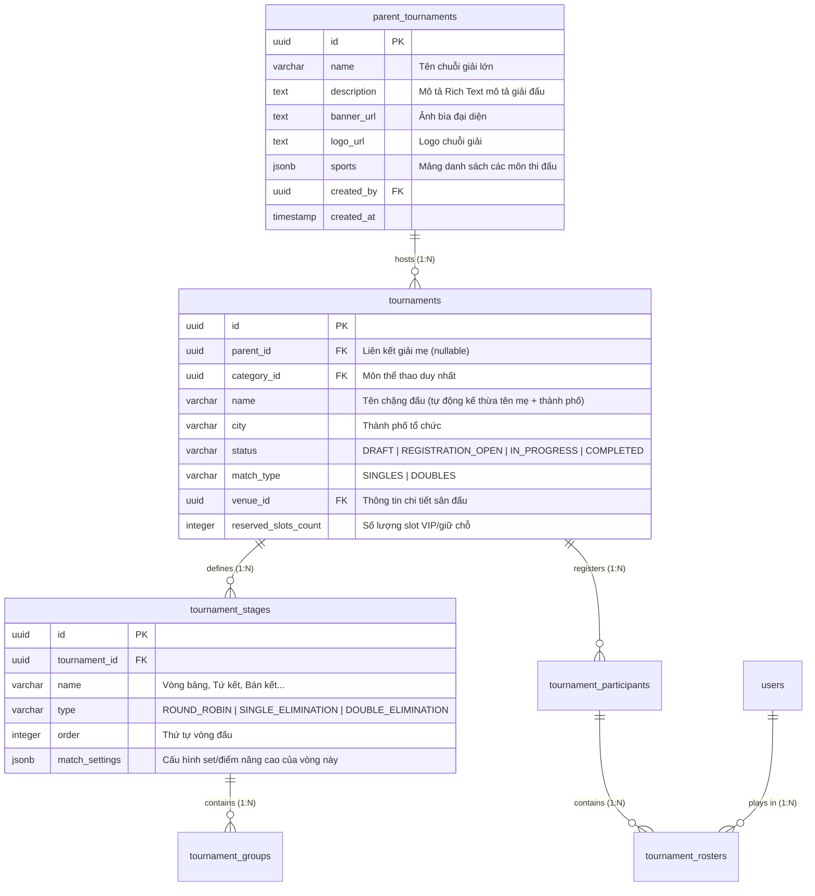
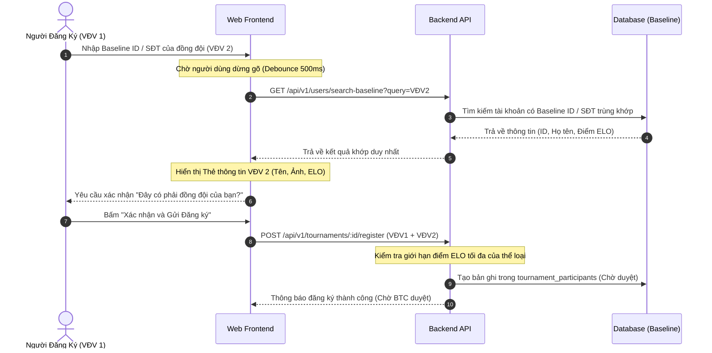

# 🏆 Đặc tả Kiến trúc và Nghiệp vụ: Giải đấu Mẹ (Parent) vs Giải đấu Chặng (Child)
*Phân tích chuyên sâu hệ thống quản lý giải đấu phân tầng, so sánh đối chiếu thực tế với Baseline.vn và đề xuất giải pháp thiết kế tối ưu.*

---

## 1. Nghiên cứu thực tế và Đối chiếu Mô hình: Baseline.vn vs Hệ thống của chúng ta

### 1.1 Bối cảnh từ Baseline.vn (Chuỗi "Đường Đến Superstars Cup")
Trong thực tế, **Baseline.vn** là nền tảng quản lý giải đấu Pickleball và Tennis hàng đầu. Khi nghiên cứu chuỗi giải "Đường Đến Superstars Cup" được tổ chức bởi CLB Pickleball Superstar phối hợp với Baseline:
*   **Mô hình Tour/Series**: Hệ thống gồm nhiều chặng đấu vòng loại tại các thành phố/tỉnh thành (Đà Lạt, Đà Nẵng, Thanh Hóa, Bảo Lộc, Đức Trọng...) diễn ra liên tiếp.
*   **Vòng Chung Kết (Grand Finals)**: Nơi quy tụ các vận động viên (VĐV) đạt thứ hạng cao từ các chặng vòng loại (ví dụ: Top 2 nhận vé thẳng, Top 16 bảng điểm tích lũy nhận vé vớt).
*   **Giới hạn môn thi đấu**: Mỗi chặng đấu cụ thể tại một địa phương chỉ tổ chức cho **duy nhất một môn thể thao** (ví dụ: chặng Bảo Lộc chỉ thi đấu Pickleball). Tuy nhiên, toàn bộ hệ thống Tour lớn (Giải mẹ) có thể tích hợp nhiều bộ môn thể thao khác nhau trong kế hoạch truyền thông tổng thể.

### 1.2 Những điểm yếu trên Web của Baseline.vn & Cơ hội nâng cấp
Qua phân tích trải nghiệm trên Baseline.vn phiên bản Web, chúng tôi phát hiện một số hạn chế quan trọng:
1.  **Thiếu trang tổng hợp Series**: Các giải đấu chặng của cùng một chuỗi nằm rời rạc dưới dạng các sự kiện độc lập. Người dùng chỉ có thể tìm thấy chúng bằng cách cuộn danh sách giải đấu của một Câu lạc bộ cụ thể.
2.  **Không có bảng xếp hạng tích lũy (PSR Standings) trực quan trên Web**: Điểm tích lũy của chuỗi (PSR Points) không được hiển thị tập trung trên giao diện Web, gây khó khăn cho việc theo dõi cơ hội nhận "vé vớt" của các VĐV.
3.  **Hệ thống Rating phụ thuộc bên thứ ba**: Baseline sử dụng hệ thống điểm trình **DUPR** quốc tế. Điều này đòi hỏi người chơi phải có tài khoản DUPR và liên kết phức tạp.
4.  **Thiếu tính minh bạch của Luật khóa (Exclusion/Lock-out Rule)**: Người chơi không tự theo dõi được trạng thái "bị khóa đăng ký giải chặng tiếp theo" sau khi đã giành vé thẳng (Top 2).

### 1.3 Mô hình Cải tiến của chúng ta (Unified Parent-Child Model)
Chúng tôi thiết kế kiến trúc phân tầng **Giải đấu Mẹ (Parent Tournament)** và **Giải đấu Chặng (Child/Leg Tournament)** để giải quyết triệt để các vấn đề trên:

| Tiêu chí so sánh | Baseline.vn (Web) | Giải pháp Kiến trúc của chúng ta |
| :--- | :--- | :--- |
| **Giao diện chuỗi giải** | Không có trang tổng quan chuỗi, các giải hiển thị rời rạc. | Trang **Giải đấu Mẹ** đóng vai trò Hub trung tâm, chứa toàn bộ Timeline, Map chặng thi đấu và danh sách nhà tài trợ. |
| **Đa môn thể thao (Multi-sport)** | Phải tạo các giải rời rạc thủ công. | Giải đấu Mẹ hiển thị overview đa môn; các giải chặng con thừa hưởng thông tin nhưng giới hạn chính xác **1 môn duy nhất**. |
| **Hệ thống Điểm trình** | DUPR (Yêu cầu tích hợp API quốc tế dupr.com). | Hệ thống điểm **ELO nội bộ tự tính toán** dựa trên kết quả trận đấu thực tế của người chơi. |
| **Ràng buộc đăng ký Đôi** | Nhập tên thủ công hoặc qua App mobile. | Đăng ký trực tiếp trên Web, validate thời gian thực (real-time) tài khoản của Partner qua cơ sở dữ liệu hệ thống. |
| **Trực quan hóa Luật khóa** | Không hiển thị trực quan trạng thái khóa. | Tự động hiển thị tag `[ĐÃ CÓ VÉ CHUNG KẾT]` và ẩn nút Đăng ký khi tài khoản đạt đủ điều kiện. |

---

## 2. Thiết kế Cơ sở Dữ liệu chi tiết (Detailed Database Schema)

Để không ảnh hưởng đến cấu trúc tính điểm, sinh nhánh đấu (Bracket Engine) đã chạy ổn định, chúng tôi áp dụng thiết kế mở rộng cơ sở dữ liệu bằng cách liên kết bảng `parent_tournaments` với bảng `tournaments` hiện tại.



### 2.1 Cập nhật Định nghĩa các Bảng (Drizzle Schema Typescript)

#### Bảng Giải đấu Mẹ `parent_tournaments`
```typescript
export const parentTournaments = pgTable('parent_tournaments', {
  id: uuid('id').primaryKey().defaultRandom(),
  name: varchar('name', { length: 255 }).notNull(),
  description: text('description'),
  bannerUrl: text('banner_url'),
  logoUrl: text('logo_url'),
  sports: jsonb('sports').$type<string[]>().default([]).notNull(), // Ví dụ: ['pickleball', 'tennis']
  createdBy: uuid('created_by').references(() => users.id, { onDelete: 'restrict' }).notNull(),
  createdAt: timestamp('created_at', { withTimezone: true }).defaultNow().notNull(),
  updatedAt: timestamp('updated_at', { withTimezone: true }).defaultNow().notNull(),
  deletedAt: timestamp('deleted_at', { withTimezone: true }),
});
```

#### Bảng Giải đấu Chặng `tournaments` (Bổ sung cột)
```typescript
// Thêm cột liên kết và thông tin vị trí địa lý
export const tournaments = pgTable('tournaments', {
  // ... các cột cũ giữ nguyên ...
  parentId: uuid('parent_id').references(() => parentTournaments.id, { onDelete: 'cascade' }),
  city: varchar('city', { length: 100 }), // Thành phố tổ chức chặng
  reservedSlotsCount: integer('reserved_slots_count').default(0).notNull(), // Số lượng slot đặc quyền
});
```

---

## 3. Thiết lập Nâng cao cho Vòng đấu (Advanced Match Rules Engine)

Ban tổ chức (BTC) có thể cấu hình luật thi đấu cực kỳ linh hoạt cho từng vòng đấu/giai đoạn (Stage). Luật này sẽ ghi đè cấu hình mặc định của giải đấu khi tiến hành cập nhật kết quả trận đấu.

### 3.1 Cấu trúc cấu hình Vòng đấu (`match_settings` trong `tournament_stages`)
```typescript
interface MatchSettings {
  maxSets: 1 | 3 | 5;             // Số set đấu tối đa (Đánh 3 set thắng 2, Đánh 5 set thắng 3)
  pointsPerSet: number;           // Điểm để thắng 1 set bình thường (11, 15, 21)
  winBy2Points: boolean;          // Bắt buộc thắng cách biệt 2 điểm (Deuce)
  maxDeucePoints?: number;        // Giới hạn điểm chạm tối đa khi deuce (ví dụ tối đa 30 điểm thì dừng)
  superTiebreakEnabled: boolean;  // Có áp dụng set quyết định tiebreak đặc biệt không
  superTiebreakSetIndex?: number; // Vị trí set áp dụng super tiebreak (ví dụ set 3)
  superTiebreakPoints?: number;   // Điểm thắng của set super tiebreak (thường là 10 điểm)
}
```

### 3.2 Logic áp dụng khi cập nhật Tỷ số trận đấu (Match Scoring Algorithm)
Khi trọng tài nhập điểm số cho trận đấu thuộc một vòng cụ thể, hệ thống sẽ thực hiện kiểm tra:
1.  **Bước 1**: Lấy thông tin `stageId` của trận đấu đó.
2.  **Bước 2**: Truy vấn cấu hình `match_settings` của Stage tương ứng.
3.  **Bước 3**: Tiến hành chấm điểm theo thuật toán:
    ```typescript
    function checkSetWinner(scoreA: number, scoreB: number, settings: MatchSettings): 'A' | 'B' | 'PENDING' {
      const targetPoints = settings.pointsPerSet;
      
      if (settings.winBy2Points) {
        const maxPoints = settings.maxDeucePoints || Infinity;
        if (scoreA >= targetPoints && (scoreA - scoreB) >= 2) return 'A';
        if (scoreB >= targetPoints && (scoreB - scoreA) >= 2) return 'B';
        
        // Đạt mốc điểm tối đa (Golden Point tại điểm trần deuce)
        if (scoreA === maxPoints) return 'A';
        if (scoreB === maxPoints) return 'B';
      } else {
        if (scoreA === targetPoints) return 'A';
        if (scoreB === targetPoints) return 'B';
      }
      return 'PENDING';
    }
    ```

---

## 4. Quản lý Danh sách Người chơi ảo (Mock Participant & Testing Panel)

Để tạo điều kiện cho Ban tổ chức kiểm thử sơ đồ thi đấu (Bracket) trước khi mở cổng đăng ký chính thức, hệ thống hỗ trợ một bảng điều khiển nhập liệu người chơi ảo (Mock Participant Panel).

### 4.1 Quy trình Sinh Dữ liệu Mock
1.  **Nhập liệu**: BTC dán danh sách tên vận động viên vào ô Textarea, mỗi dòng đại diện cho một người/đội chơi.
2.  **Sinh Tài khoản ảo (Mock Users)**:
    *   Tự động sinh tài khoản ảo trong bảng `users` với cờ `is_mock = true`.
    *   Tên hiển thị được lấy từ danh sách nhập vào.
    *   Số ELO mặc định được gán ngẫu nhiên trong khoảng thiết lập (ví dụ: `1200 - 1500`) để mô phỏng sự chênh lệch trình độ.
3.  **Bắt cặp đăng ký**:
    *   *Đối với Đơn*: Tạo trực tiếp bản ghi trong `tournament_participants` và liên kết với một `tournament_rosters` của tài khoản mock đó.
    *   *Đối với Đôi*: Cứ mỗi 2 dòng tên liên tiếp sẽ được gộp thành 1 cặp đấu (Team), tự động đặt tên đội là `Tên VĐV 1 - Tên VĐV 2` và sinh mã `team_status = 'APPROVED'`.

### 4.2 Nút xóa nhanh (Reset / Clean-up Action)
Khi kết thúc quá trình test, BTC nhấn nút **"Dọn dẹp dữ liệu thử nghiệm"**. Backend sẽ kích hoạt Transaction:
```sql
-- Xóa tất cả rosters của người chơi mock trong giải đấu này
DELETE FROM tournament_rosters 
WHERE participant_id IN (
  SELECT id FROM tournament_participants WHERE tournament_id = :tournamentId
) AND user_id IN (SELECT id FROM users WHERE is_mock = true);

-- Xóa tất cả các đội thi đấu mock
DELETE FROM tournament_participants 
WHERE tournament_id = :tournamentId;

-- Dọn sạch tài khoản mock khỏi hệ thống
DELETE FROM users WHERE is_mock = true;
```

---

## 5. Luồng Đăng ký tích hợp Tài khoản Baseline

Hệ thống của chúng ta liên kết tài khoản Baseline của người chơi qua mã định danh `baseline_id` hoặc số điện thoại đăng ký. Điều này đảm bảo tính nhất quán về dữ liệu ELO.

### 5.1 Luồng Đăng ký đôi (Doubles Registration Workflow)
Đối với hình thức thi đấu đôi, hệ thống ràng buộc chặt chẽ để tránh đăng ký "ảo":



---

## 6. Quy trình Phê duyệt của Ban tổ chức & Quản lý Slot giữ chỗ

Ban tổ chức giải đấu đóng vai trò kiểm soát chất lượng chuyên môn (Match Quality) bằng cách phê duyệt hồ sơ người đăng ký dựa trên trình độ ELO thực tế.

### 6.1 Quy trình Duyệt người chơi (Approval Pipeline)
*   **Màn hình duyệt**: BTC nhìn thấy danh sách VĐV dưới dạng bảng phân loại theo thể loại đấu.
*   **Xem nhanh hồ sơ (Quick Profiling)**:
    *   Khi rê chuột hoặc nhấp vào VĐV, hệ thống hiển thị biểu đồ ELO thay đổi gần nhất vẽ bằng **Recharts**.
    *   Thống kê tỷ lệ thắng/thua (Win Rate), lịch sử vi phạm bỏ cuộc (Walkover Rate) và các giải đấu chặng họ đã tham gia gần đây.
*   **Hành động**:
    *   **Duyệt (Approve)**: Người chơi/cặp đấu chuyển sang trạng thái chính thức, được xếp hạt giống (Seed) và tự động tính vào tổng số lượng slot đã bán.
    *   **Từ chối (Reject)**: Hệ thống tự động gửi thông báo (Notification) kèm lý do từ chối (ví dụ: "Điểm ELO vượt quá giới hạn của phân hạng").

### 6.2 Cơ chế Slot giữ chỗ (Reserved Slots / Wildcards)
Trong các giải đấu lớn theo mô hình Baseline, BTC luôn cần giữ lại một số suất đấu đặc quyền cho nhà tài trợ hoặc khách mời đặc biệt:
*   **Bảo vệ Slot**: Khi số lượng người đăng ký chính thức đạt mức tối đa (`maxParticipants - reservedSlotsCount`), hệ thống sẽ tự động khóa nút đăng ký công khai của người dùng thường và hiển thị trạng thái `HẾT SUẤT ĐĂNG KÝ CÔNG KHAI`.
*   **Gán đặc cách (Direct Assignment)**: Trong trang quản lý, BTC có một phân vùng riêng mang tên **"Wildcard / Suất Đặc Cách"**. Tại đây, BTC có thể nhập tài khoản Baseline của khách mời và bấm **"Gán trực tiếp"**.
*   **Bỏ qua xác thực điểm ELO**: Hệ thống sẽ bỏ qua mọi quy tắc giới hạn về điểm ELO/DUPR khi BTC gán trực tiếp suất đặc cách cho khách mời.
